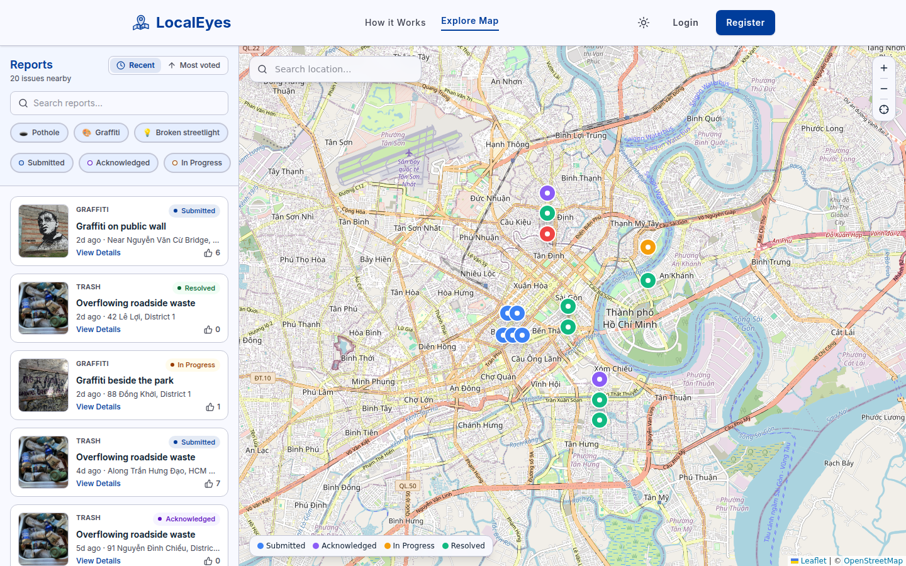
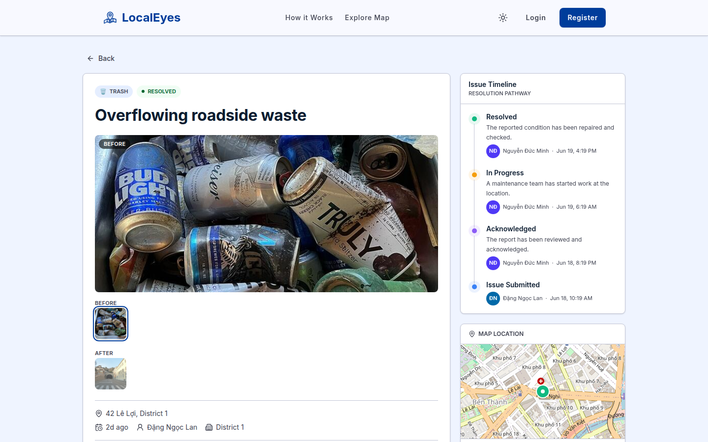
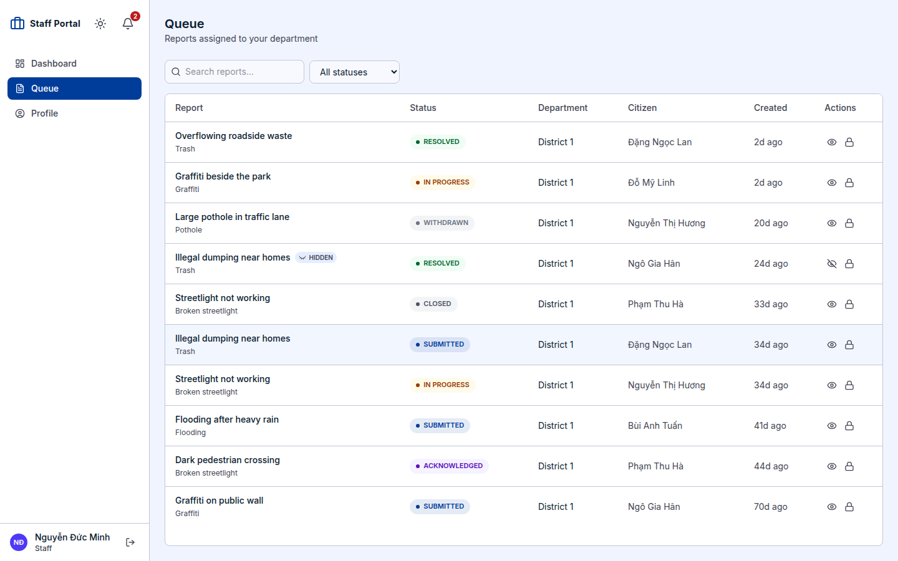
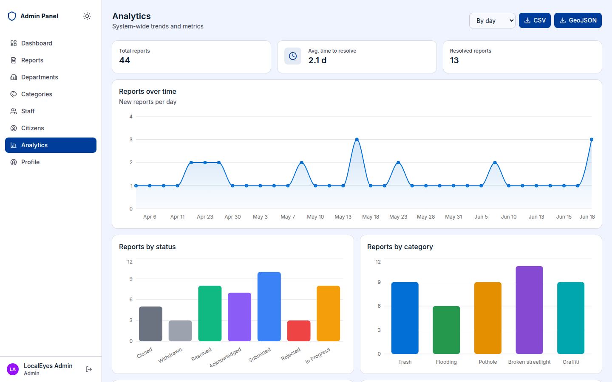
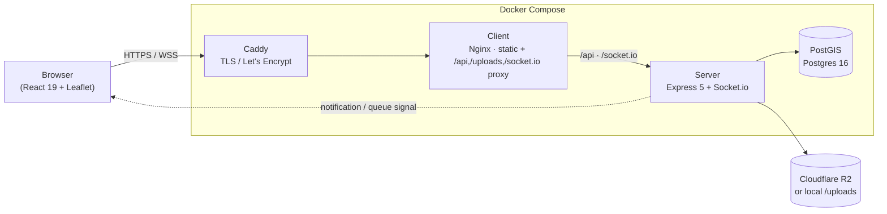
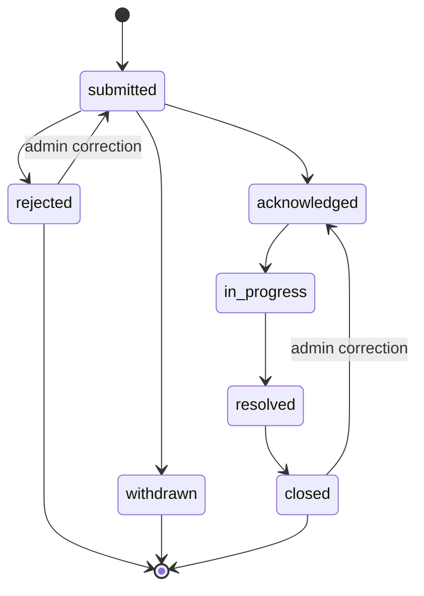

# LocalEyes

> A civic issue-reporting platform for Ho Chi Minh City — citizens pin problems on a map, the responsible city department resolves them, and admins manage the whole operation.

<p>
  <a href="https://github.com/forevpurity/LocalEyes/actions/workflows/deploy.yml"></a>
  
  
  
  
  
  
  
</p>

LocalEyes lets a **Citizen** photograph and pin a problem (pothole, broken streetlight,
flooding, graffiti, trash) on a map. The report is **auto-routed to the city Department
whose geographic area contains the pin**, where **Staff** acknowledge it, move it through a
status lifecycle, and resolve it. **Admins** manage departments, categories, users,
moderation, and analytics from a dedicated panel.

Built as an end-to-end product: geospatial routing, real-time notifications, role-based
access, image uploads, moderation tooling, and CSV/GeoJSON data export.

**[Live demo →](https://localeyes.click)** — running on the demo seed. Sign in with any of the [demo logins](#demo-logins). It's a shared sandbox, so anything you create may be wiped when the demo data is re-seeded.

## Screenshots

<table>
  <tr>
    <td width="50%"></td>
    <td width="50%"></td>
  </tr>
  <tr>
    <td></td>
    <td></td>
  </tr>
</table>

<p align="center"><em>Public map · report detail &amp; status timeline · staff department queue · admin analytics.</em></p>

## Features

**Citizens** — file a report with photos and a map pin, auto-routed to the department whose
area contains it; vote on, comment on, withdraw, and subscribe to reports; track personal
report stats; manage their profile and avatar.

**Staff** — work a department-scoped report queue, advance each report through its status
lifecycle (every change requires a note), comment, and moderate — hide/unhide reports and
comments, and lock/unlock reports (freezing comments, votes, and subscriptions) — backed by a
per-department dashboard.

**Admins** — manage departments and their PostGIS boundaries, categories, and staff/citizen
accounts (including ban/unban); moderate content site-wide; assign reports that landed outside
every boundary; view system-wide analytics; and export reports as CSV or GeoJSON.

**Cross-cutting** — real-time notifications over Socket.io with newly created reports
appearing live on the map, JWT auth with refresh tokens and password reset, role-based access
control, and cursor pagination for large list endpoints.

## Highlights

- **🗺️ PostGIS geo-routing.** Departments are defined by non-overlapping PostGIS polygons.
  A new report is auto-assigned to the department whose area contains its pin via a
  point-in-polygon query; pins outside every polygon land in an **Unassigned Queue** for
  manual assignment. Boundary overlap is rejected at creation/update time.
  → [ADR-0001](docs/adr/0001-postgis-polygon-department-routing.md)

- **🔔 Real-time notifications with the database as source of truth.** Notifications are
  persisted to Postgres (the truth) and pushed over Socket.io as a *best-effort* overlay —
  offline users fetch what they missed on next load. Recipients are scoped per event type,
  and Citizen notifications are kept distinct from Staff "queue signals" even though they
  share table and channel infrastructure.
  → [ADR-0006](docs/adr/0006-queue-signals-share-notifications-table.md)

- **📜 One schema for request validation *and* API docs.** For JSON endpoints a single Zod
  schema both validates the incoming request at runtime and generates that request's OpenAPI
  spec (via `zod-openapi`), so the documented request body can't drift from what the handler
  actually accepts. Response schemas describe each payload's shape for the docs, but responses
  are assembled by hand and **not** runtime-validated against them. The `multipart/form-data`
  upload endpoints document their wire-level form separately: Multer plus manual checks validate
  the files, and report creation additionally parses its non-file fields (title, coordinates,
  category) through a runtime schema — the photo and avatar uploads carry files only.
  Browse the docs at `/api/docs` in dev.

- **🧱 Vertical-slice architecture.** Feature-per-folder, **one file = one mounted
  endpoint**, with shared domain rules in per-feature `lib/` folders. JWT access/refresh
  tokens in HTTP-only cookies with transparent `401 → refresh → retry`, department-scoped
  staff access, and cursor-based pagination on the large list endpoints.
  → [ADR-0002](docs/adr/0002-vertical-slice-architecture.md)

## Architecture



The production stack is **Caddy → Nginx (client) → Express (server) → PostGIS**. Caddy
terminates TLS, the client container serves the SPA and proxies API/socket traffic, and the
server talks to PostGIS and to image storage (local disk or Cloudflare R2).

## Tech stack

| Layer | Tech |
| --- | --- |
| **Frontend** | React 19 · Vite · TypeScript · Tailwind CSS 4 · Base UI · React Router · TanStack Query · React Hook Form · Leaflet · Socket.io client · sonner |
| **Backend** | Node ≥22 · Express 5 · TypeScript · Drizzle ORM · Zod + `zod-openapi` · Socket.io · JWT (`jsonwebtoken`) · bcryptjs · Multer · nodemailer · express-rate-limit |
| **Data** | PostgreSQL 16 + PostGIS |
| **Storage** | Local disk or Cloudflare R2 (S3-compatible) |
| **Infra** | Docker Compose · Caddy (TLS) · Nginx |

## Quickstart (Docker)

The fastest way to see LocalEyes running with realistic demo data. Requires Docker.

```bash
git clone https://github.com/forevpurity/LocalEyes.git
cd LocalEyes

# 1. Create the env file (DOMAIN defaults to localhost → Caddy uses its own local CA)
cp .env.docker.example .env

# 2. Generate the two JWT secrets and paste them into .env
openssl rand -hex 32   # → JWT_ACCESS_SECRET
openssl rand -hex 32   # → JWT_REFRESH_SECRET

# 3. Build and start the stack
docker compose up -d --build

# 4. Push the schema and load the demo seed (the `tools` profile runs on the box,
#    no SSH tunnel needed)
docker compose run --rm tools npm run db:push
docker compose run --rm -e SEED_RESET=true tools npm run db:seed
```

Open **https://localhost** and accept the local-CA certificate warning.

### Demo logins

All seeded accounts share the password **`password123`**.

| Role | Email | What you'll see |
| --- | --- | --- |
| **Admin** | `admin@localeyes.vn` | Full admin panel: departments, categories, users, moderation, analytics, export |
| **Staff** | `staff.d1@localeyes.vn` | District 1's report queue with status/moderation actions |
| **Citizen** | `citizen1@localeyes.vn` | Submit reports, vote, comment, manage subscriptions |

## Development (manual)

For working on the code, run the two packages directly. **Prerequisites:** Node ≥22 and a
PostgreSQL 16 instance with the **PostGIS** extension available. Enable the extension in your
database **before** `db:push` (the Docker image does this automatically; a manual Postgres
does not):

```sql
CREATE EXTENSION IF NOT EXISTS postgis;
```

This is a **two-package repo (no npm workspaces)** — `client/` and `server/` are installed
and run independently.

**Server** (`server/`, serves on port 3000):

```bash
cd server
cp .env.example .env          # DATABASE_URL + the two JWT secrets are all you need to run
npm install
npm run db:push               # push the Drizzle schema
npm run db:seed               # optional: load demo data — see warning below
npm run dev                   # tsx watch + live OpenAPI regen
```

Two optional integrations are documented in `server/.env.example`: image uploads default to
local `/uploads` unless you configure **Cloudflare R2**, and password reset needs **SMTP** —
without it, the reset link is logged to the server console instead of emailed.

> ⚠️ **`db:seed` is destructive.** It `TRUNCATE`s the `categories`, `departments`, `users`,
> and `reports` tables (cascading) before loading demo data — only run it against a database
> you're happy to wipe. As a safeguard it refuses to run when `NODE_ENV=production` unless you
> explicitly set `SEED_RESET=true`.

**Client** (`client/`, Vite dev server on port 5173, proxies `/api`, `/uploads`,
`/socket.io` to the server):

```bash
cd client
npm install
npm run dev
```

Then open **http://localhost:5173**. Interactive API docs (dev only) are at
**http://localhost:3000/api/docs**.

> There is no test runner configured; the client has `npm run lint` (ESLint). Verify
> changes by running the apps and exercising the Swagger UI. See [AGENTS.md](AGENTS.md) for
> full command reference and conventions.

### Verification

There's no test suite, but CI (`.github/workflows/deploy.yml`) gates every push to `main` on
the same typecheck/lint/build the Dockerfiles run, and deploys only if it's green. Reproduce
that gate locally before pushing:

```bash
cd server && npm run build           # tsc typecheck + build
cd ../client && npm run lint && npm run build   # ESLint, then tsc -b + vite build
```

## Report lifecycle

Every status change requires a note and an explicit confirmation. Reports are never reopened
in normal workflow — a recurring problem is a new report. The one exception is **Admin
correction**, an administrative undo of a mistaken terminal transition.



`closed`, `rejected`, and `withdrawn` are terminal. `withdrawn` is the Citizen's own choice
and is never reversible, even by an Admin.

## Roadmap & limitations

LocalEyes covers the report lifecycle end-to-end, but it's scoped as a portfolio
product. The notable features it doesn't have yet:

- **No duplicate detection or merging** — several citizens reporting the same physical
  issue create separate reports; there's no clustering or merge-into-one.
- **In-app notifications only, with no preferences** — updates surface in the app and
  over Socket.io, but citizens aren't emailed or pushed when a report changes status
  (email is wired up only for password reset), and subscription is a binary per-report
  toggle — no digests, event-type filters, or quiet hours.
- **No per-report ownership or bulk actions** — the queue is department-scoped, so any
  staffer can act on any report; there's no "this is mine", delegation, or personal
  worklist, and every status change, hide, or lock is one report at a time.
- **No public API or webhooks** — there are no API keys, no webhooks, and no documented
  machine-to-machine contract, so partner systems and transparency portals can't subscribe
  to status changes (public reads back the SPA's own map, but nothing is built for
  programmatic consumers).
- **No admin audit log** — bans, hides, locks, reassignments, polygon edits, and category
  changes leave only their resulting state, with no record of who did what and when.
- **Minimal trust-and-safety** — uploaded photos aren't screened for NSFW or off-topic
  content, and comments are covered only by the global rate limiter; there's no profanity
  filter, captcha, or image-hash duplicate detection.
- **Single-city, not multi-tenant** — Ho Chi Minh City is baked into the map centre, the
  geocoding queries, the seeds, and the deployment, so standing up another municipality is
  a code change, not config.

## Documentation

| Doc | What it covers |
| --- | --- |
| [CONTEXT.md](CONTEXT.md) | Canonical domain glossary — the ubiquitous language (actors, reports, departments, moderation, notifications). |
| [AGENTS.md](AGENTS.md) | Build/run commands, architecture, and code conventions. |
| [docs/adr/](docs/adr/) | Architecture Decision Records — the *why* behind key technical choices. |

## License

[MIT](LICENSE) © forevpurity
